# Gestore Spese

Gestore Spese è un'applicazione mobile multipiattaforma sviluppata con Flutter. Questa app aiuta gli utenti a monitorare e controllare le proprie spese quotidiane, fornendo una visione chiara delle uscite tramite la cronologia e le statistiche.

## Caratteristiche

- **Dashboard**:
  - Visualizza il saldo corrente.
  - Visualizza le ultime k spese recenti (il valore di k può essere impostato dall'utente; di default è 5, con opzioni per 10, 20, 50).
  - Inserimento rapido di una nuova spesa.
  - Modifica/Eliminazione rapida di una spesa.
  - Filtra le spese per data e/o categoria.

- **Schermata Dettaglio Spese**:
  - Elenco di tutte le spese effettuate.
  - Mostra il saldo disponibile ed il possibile saldo contabile (ovvero spese probabilmente non contabilizzate ancora dagli instituti bancari).
  - Ogni voce mostra l'importo, la data, la categoria e una breve descrizione.

- **Schermata Aggiungi/Modifica Spesa**:
  - Consente agli utenti di aggiungere una nuova spesa o modificare una esistente.
  - Una spesa può appartenere ad una o più categorie contemporaneamente.

- **Schermata Statistiche**:
  - Visualizzazione tramite grafici di tipo Linea, Barre e Torta di diverse statistiche:
    - Andamento delle spese nel tempo
    - Importo medio e totale per ogni categoria
  - Visualizzazione delle top-k uscite (per importo massimo e minimo).

- **Notifiche**:
  - Notifiche push per ricordare agli utenti di registrare le loro spese.
  - Impostate a ripetizione di 1 minuto. Per il release dovrebbe essere impostato come 'daily'.

## Screenshot

 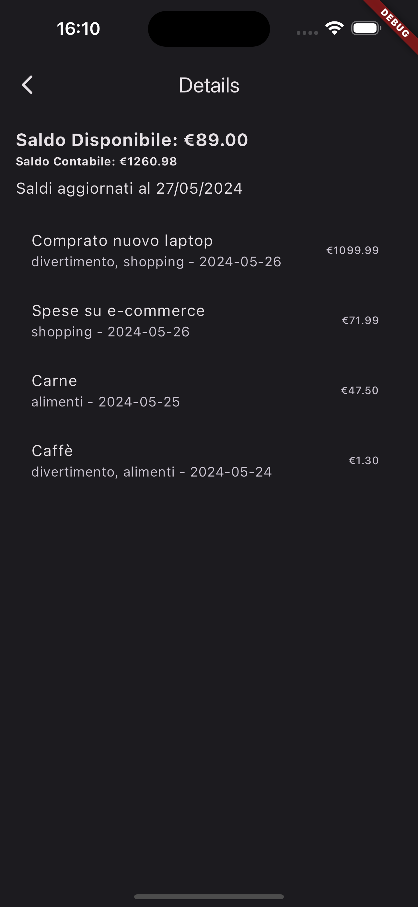 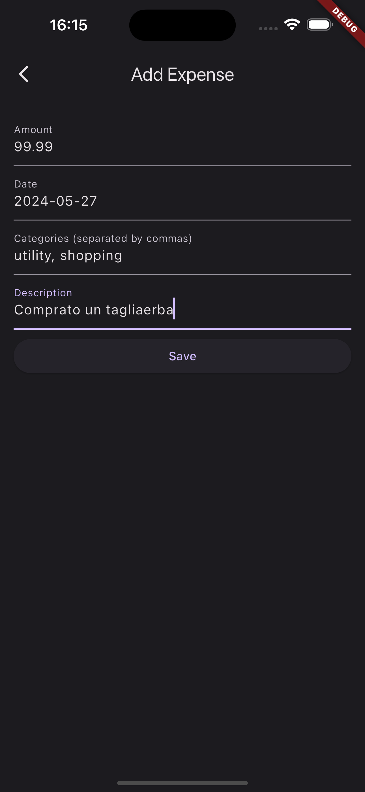 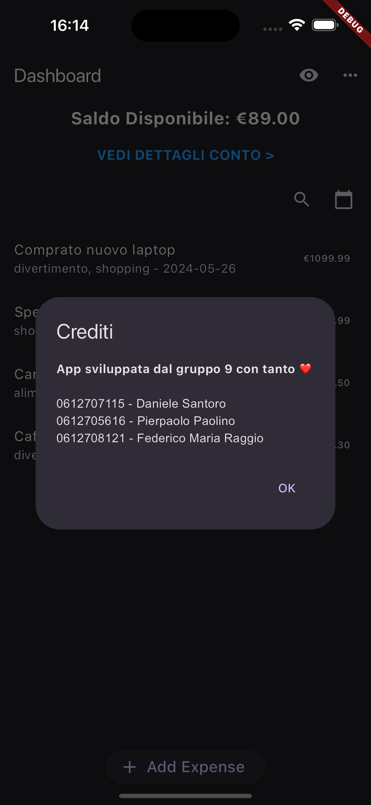

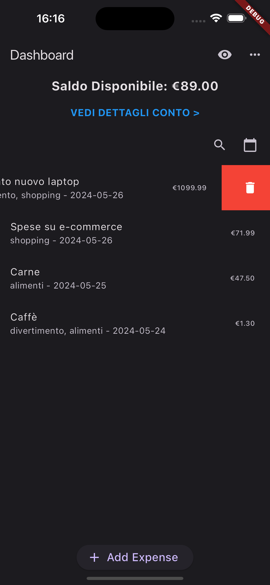 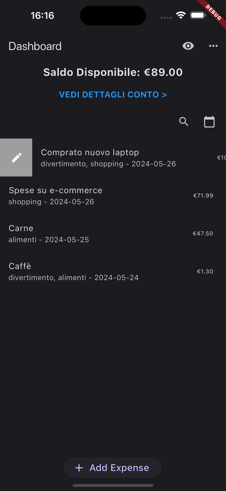 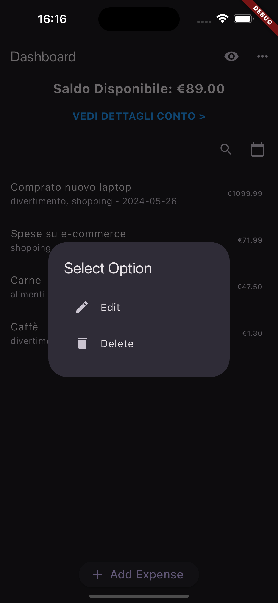 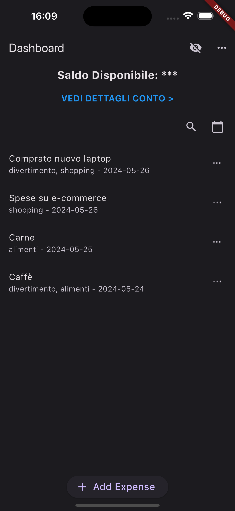

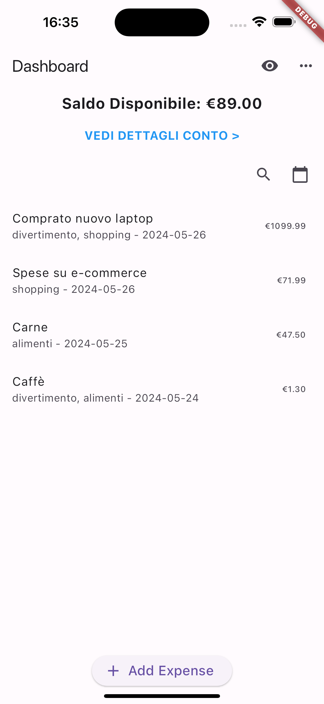 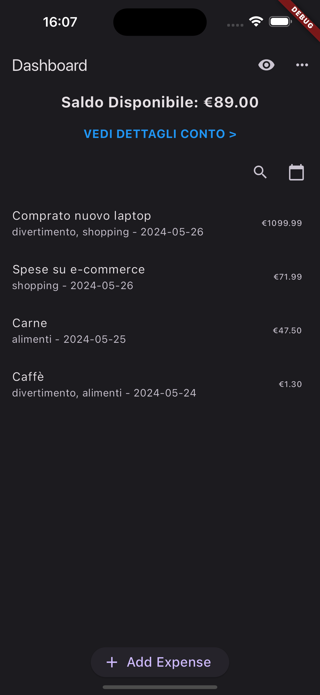 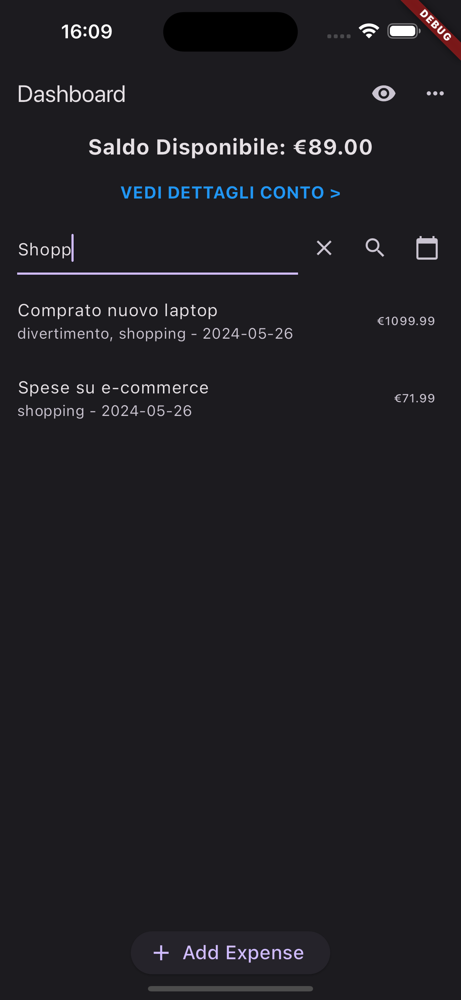 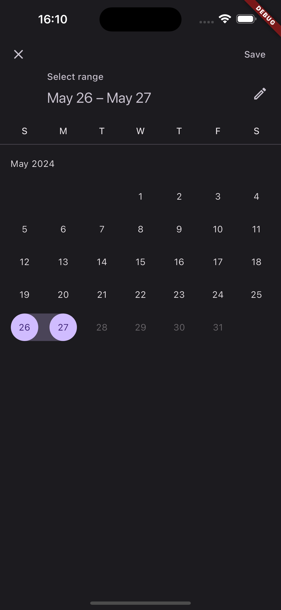

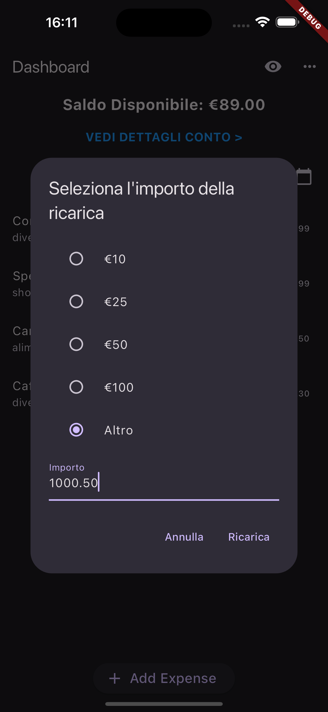 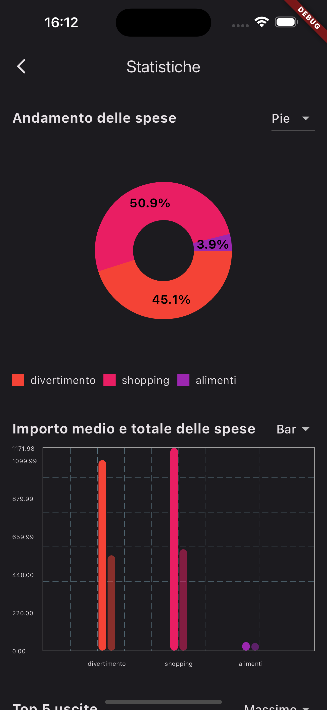 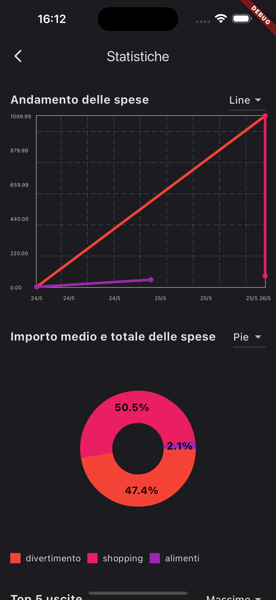 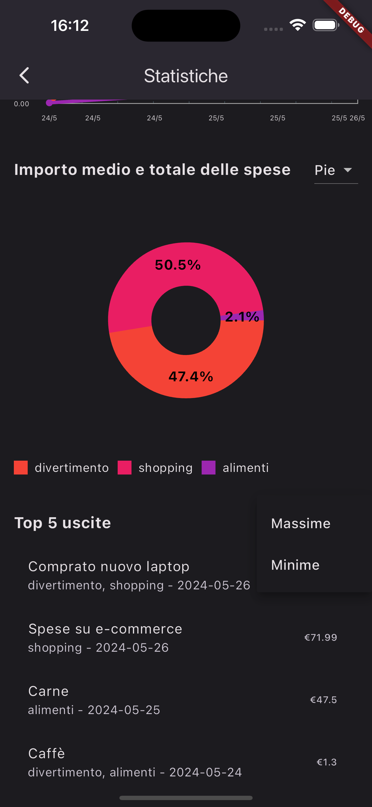

## Installazione

Per eseguire questo progetto, segui questi passaggi:

1. **Clona il repository**:
   ```bash
   git clone https://github.com/tuo_username/gestore_spese.git
   cd gestore_spese
   ```

2. **Installa le dipendenze**:
   ```bash
   flutter pub get
   dart pub get
   ```

3. **Esegui l'app**:
   ```bash
   flutter run
   ```

## Configurazione

### iOS

1. Apri `ios/Runner.xcworkspace` in Xcode.
2. Assicurati che le firme e le capacità corrette siano impostate.
3. Esegui il progetto sul tuo dispositivo iOS o simulatore.

### Android

1. Assicurati di avere un emulatore Android configurato o un dispositivo Android collegato.
2. Esegui il progetto utilizzando:
   ```bash
   flutter run
   ```

## Uso

- Nella dashboard, puoi vedere rapidamente il tuo saldo e le spese recenti.
- Usa il pulsante "Add Expense" per registrare una nuova spesa.
- Naviga nell'app per visualizzare la cronologia dettagliata delle spese, filtra per date o categorie e visualizza statistiche complete sulle tue abitudini di spesa.
- Ricevi promemoria giornalieri per registrare le tue spese.

## Contribuire

1. Fai un fork del repository.
2. Crea il tuo branch di funzionalità (`git checkout -b feature/FunzioneStraordinaria`).
3. Committa le tue modifiche (`git commit -m 'Aggiungi una FunzioneStraordinaria'`).
4. Fai il push del branch (`git push origin feature/FunzioneStraordinaria`).
5. Apri una pull request.

## Note
Da precisare che sono stati modificati file relativi ad ios e android per permettere di inizializzare le notifiche, tra cui:
1. Il set di icone per iOS in /ios/Runner/Assets.xcassets/AppIcon.appiconset/*
2. AppDelegate.swift per permettere l'inizializzazione delle notifiche e permessi su iOS (/ios/Runner/AppDelegate.swift)
3. Il set di icone per Android in /android/app/src/main/res/*/*, aggiungendo icone per App e per Notifiche
4. AndroidManifest.xml per permettere l'inizializzazione delle notifiche e permessi su Android (/android/app/src/main/AndroidManifest.xml)
5. keep.xml per evitare di far rimuovere le icone durante la compilazione dal compilatore R8. (/android/app/src/main/res/raw/keep.xml)

Ref. (https://github.com/MaikuB/flutter_local_notifications/blob/master/flutter_local_notifications/README.md)

## Crediti
- Daniele Santoro - 0612707115
- Pierpaolo Paolino - 0612705616
- Federico Maria Raggio - 0612708121
